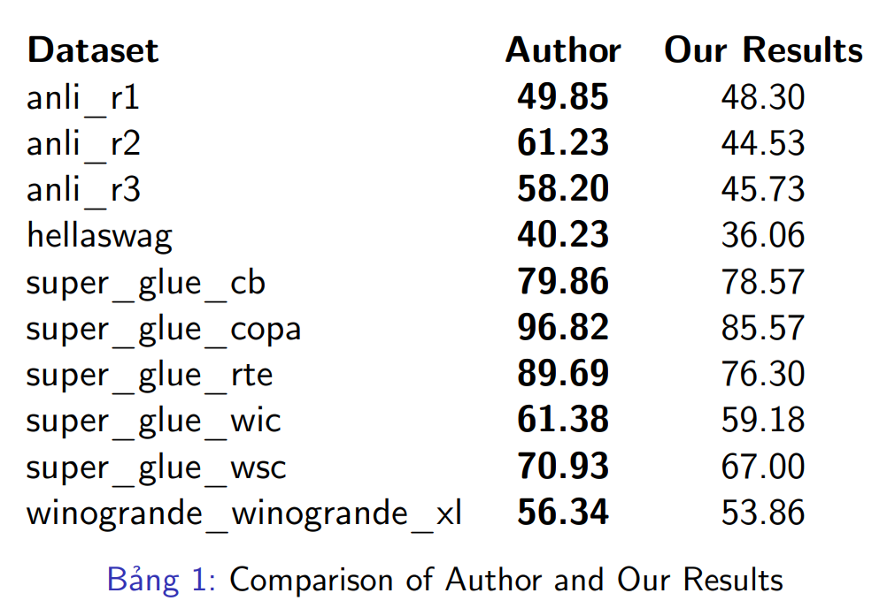

## GPS: Genetic Prompt Search for Efficient Few-shot Learning


This is the implementation of the paper GPS: Genetic Prompt Search for Efficient Few-shot Learning. 
GPS is an automatic prompt search method based on genetic algorithm for better few-shot learning.

## Overview


In the paper, they introduce Genetic Prompt Search (GPS) to improve few-shot learning with prompts, which utilizes a genetic algorithm to automatically search for high-performing prompts. GPS is gradient-free and requires no update of model parameters but only a small validation set.

You can find more details of this work in [GPS][1].

[1]: https://arxiv.org/abs/2210.17041 "GPS"

We replicated the experimental setup of the original paper using smaller pre-trained language models, specifically T0-3B and T5-XL. While the authors conducted nine iterations, we were limited by computational resources and thus performed eight iterations.

Our result is represented in this table:



## How to reproduce their results
1. Install dependencies:
   * transformers==4.15
   * datasets==1.16
   * pytorch
   * accelerate
   * yaml
   * jinja2
   * pandas
   * numpy
   * tqdm
   * sentencepiece
   * sklearn
   * protobuf==3.20.0
2. Download model checkpoints:
   * ```cd pretrained_model```
   * Download [T0](https://huggingface.co/bigscience/T0)
   * Download [T5-xxl](https://huggingface.co/google/t5-xxl-lm-adapt)
3. Prepare the data
   * We have put the data in ```./T0_dataset```
4. Prepare initial templates
   * We have put the initial templates in ```./templates```
5. Run GPS: ```python ga_processer_t0.py```
6. Get output templates and eval:
   * The output files are stored in the ```./ga_t0_t5_lm``` by default
   * We also provide output templates reported in our paper(in ```./ga_t0_t5_lm_maxstep9```).
   * Run command to launch the evaluation: ```sh run_all_eval.sh```
   


## Citation
todo
